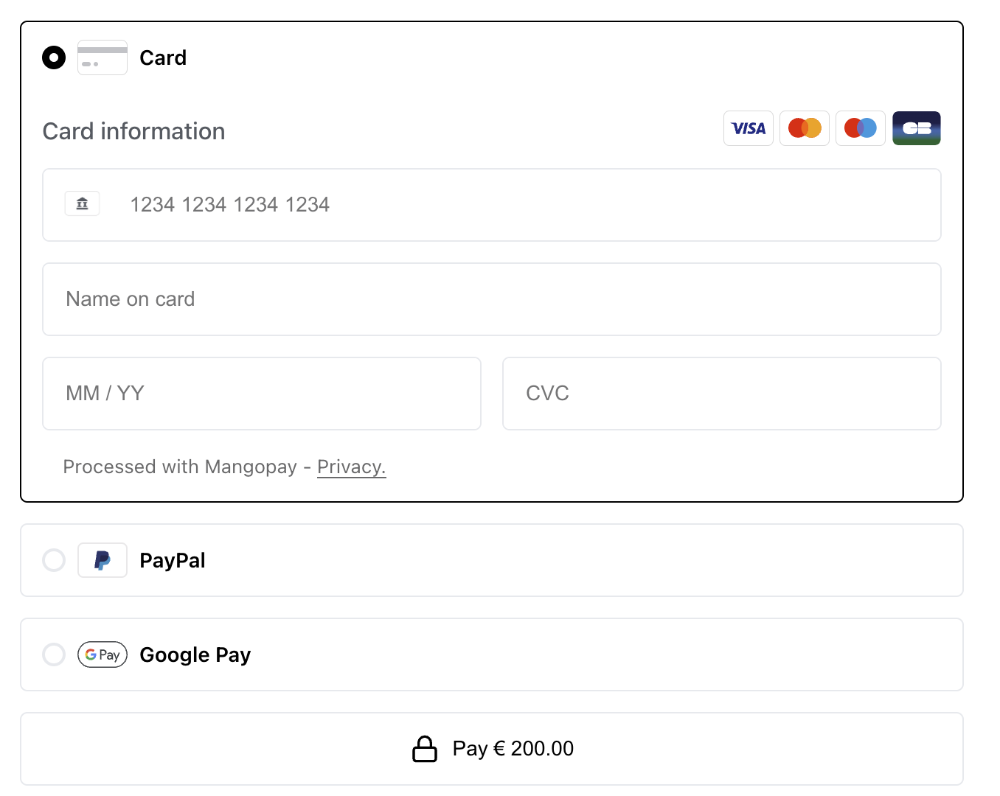

<h1>
    
    Mangopay Checkout Example
</h1>

 
 

| Example                                                             | Description                                                                                                         |
| ------------------------------------------------------------------- | ------------------------------------------------------------------------------------------------------------------- |
| [Checkout SDK JS](/examples/checkout-sdk-js) | This example demonstrates vanilla Javascript integration of the CheckoutSDK (without using a framework) |
| [Checkout SDK React](/examples/checkout-sdk-react) | This example demonstrates how to use the Checkout SDK in a React application. |
| [Checkout SDK VueJS2](/examples/checkout-sdk-react) | This example demonstrates how to use the Checkout SDK in a VueJS2 application. |

# ✅ Requirements

 - **Mangopay Sandbox Account**: Make sure you have a Mangopay sandbox account set up. This will provide you with a secure testing environment for integrating the Checkout functionality.

 - **Development Environment**: You'll need to have  Node.js and either Yarn or npm installed on your machine.

 - **Time Commitment**: The integration process is straightforward and should take approximately 10 minutes of your time.

## 🔑 Account creation and the API Key
You can get yourself a free sandbox account or sign up for a production account by registering on the Mangopay site (note that validation of your production account involves several steps, so think about doing it in advance of when you actually want to go live).

Login to your Mangopay Hub account, and grab your `clientId` and `API Key`, or create a new one. 

## 🌐 Configure and setup the backend
To facilitate end-to-end testing of your integration, we offer a pre-configured example back-end hosted on [Glitch](https://glitch.com/edit/#!/mangopay-example-checkout-backend). Follow these steps to set it up:

 - [Open the Glitch project](https://glitch.com/edit/#!/mangopay-example-checkout-backend?path=README.md).
 - Click the "Remix" button in the top-right corner to create your own copy of the project.
 - In your newly remixed project, locate the `.env` file in the left sidebar and open it.
 - Set your Magopay credentials as specified in the project's README.md file.
 - With the credentials configured, your back-end implementation should now be up and running. You can monitor its activity by checking the logs in the bottom panel by clicking on the "Logs" button.

## 👨‍💻 Installation

1. Clone this repository: `git clone https://github.com/Mangopay/mangopay-checkout-web.git`
3. Setup the frontend. You can use either vanilla, react or vuejs flavor of the examples.
    * `cd mangopay-checkout-web/examples/checkout-sdk-js`
    * rename `.env.example` file to `.env` and populate the fields with your credentials.
    * set to example backend project in Glitch 
        `VITE_BACKEND_API=https://https://mangopay-example-checkout-backend.glitch.me/`
    * `npm install` or `yarn install`
    * `npm run start` or `yarn start`

## 💳 Access the checkout
Check the checkout at http://localhost:8880/.

You should see the Checkout UI appear with the configured payment methods in your test! 🎉

See [Testing Payment Methods](https://mangopay.com/docs/dev-tools/testing/payment-methods) for Test Data

# 👀 What's next?
 - ✨ Explore the full capabilities of our Hub
 - 🎨 Customize the Checkout to better fit your needs
 - 🧐 Explore our Web SDK Reference and Server API Reference
 - 📖 Learn more about how Mangopay works.
 - 🤙 Reach out to us at support@mangopay.com if you are facing any issues

## Disclaimer
This code is provided as is and is only intended to be used for illustration purposes. This code is not production-ready and is not meant to be used in a production environment. This repository is to be used as a tool to help merchants learn how to integrate with Mangopay. Any use of this repository or any of its code in a production environment is highly discouraged.
